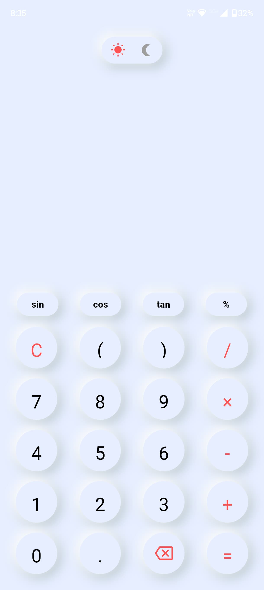
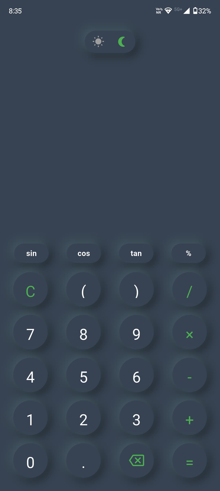
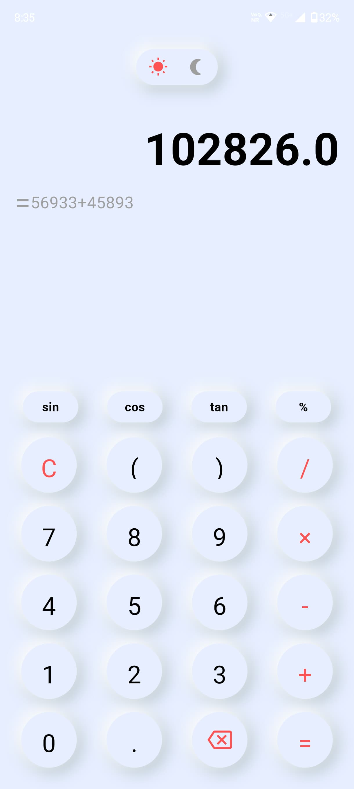
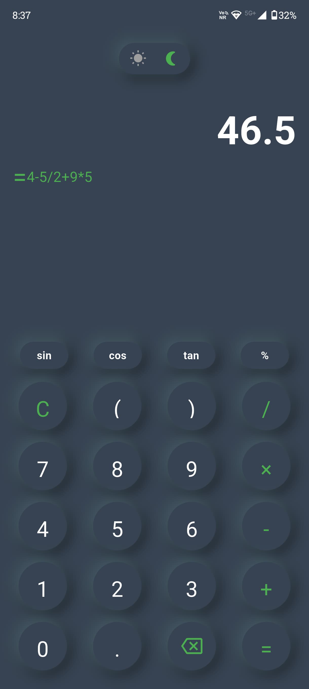

# CalC App

A beautiful, modern calculator application built with Flutter featuring neumorphism design and scientific functions.

## 📸 Screenshots

<div align="center">
<table>
  <tr>
    <td align="center">
      
      <br>
      <b>Light Mode</b>
    </td>
    <td align="center">
      
      <br>
      <b>Dark Mode</b>
    </td>
    <td align="center">
      
      <br>
      <b>Calculations</b>
    </td>
    <td align="center">
      
      <br>
      <b>Arthematic Functions</b>
    </td>
  </tr>
</table>
</div>

---

## 📱 Features

- **Neumorphism Design**: Modern UI with soft shadows and elegant visual depth
- **Dark/Light Mode**: Toggle between dark and light themes with smooth transitions
- **Scientific Functions**: Support for trigonometric functions (sin, cos, tan)
- **Basic Arithmetic**: All standard operations (+, -, ×, ÷, %)
- **Expression History**: View previous calculations and results
- **Haptic Feedback**: Enhanced user experience with tactile responses
- **Responsive Layout**: Optimized for different screen sizes
- **Error Handling**: Graceful handling of invalid expressions

## 🛠️ Technologies Used

### Framework & Language
- **Flutter**: Cross-platform mobile app development framework
- **Dart**: Programming language for Flutter development

### Key Dependencies
- **math_expressions**: Mathematical expression parsing and evaluation
- **flutter/services**: System services integration (haptic feedback)
- **flutter/material**: Material Design components

### Architecture & Design Patterns
- **StatefulWidget**: For reactive UI updates and state management
- **Custom Widgets**: Modular button components for reusability
- **Neumorphism**: Custom container implementation for modern UI aesthetics

## 🏗️ Project Structure & Logic

### Core Components

#### 1. **State Management**
- `darkMode`: Boolean flag controlling theme switching
- `_history`: String storing the previous calculation
- `_expression`: String building the current mathematical expression

#### 2. **Mathematical Engine**
- **Expression Parser**: Uses `math_expressions` library to parse mathematical strings
- **Evaluation Context**: Implements `ContextModel` for mathematical context
- **Error Handling**: Try-catch blocks for invalid expression management

#### 3. **UI Components**

##### Button Architecture
- **`_buttonRounded()`**: Circular buttons for numbers and basic operations
  - Dynamic sizing with padding parameters
  - Icon/text flexibility
  - Color customization based on theme
  - Haptic feedback integration

- **`_buttonOval()`**: Oval-shaped buttons for scientific functions
  - Horizontal padding optimization
  - Consistent typography
  - Theme-aware styling

##### Theme System
- **`_switchMode()`**: Custom toggle switch for theme switching
  - Visual indicators (sun/moon icons)
  - Smooth color transitions
  - Integrated haptic feedback

#### 4. **Core Logic Functions**

##### Input Management
- **`append(String value)`**: Adds characters to the current expression
- **`delete()`**: Removes the last character from expression
- **`clear()`**: Resets both expression and history

##### Calculation Engine
- **`evaluate()`**: 
  - Parses mathematical expression using Parser
  - Evaluates with real number context
  - Updates history with previous expression
  - Handles errors gracefully

### Design Philosophy

#### Neumorphism Implementation
- **Soft Shadows**: Creates depth without harsh contrast
- **Subtle Elevation**: Maintains clean, modern aesthetic
- **Color Harmony**: Consistent color schemes across themes

#### User Experience Features
- **Horizontal Scrolling**: Large expressions remain fully visible
- **Visual Hierarchy**: Clear distinction between input and result
- **Immediate Feedback**: Haptic responses for all interactions

## 🎨 UI/UX Design

### Color Scheme
- **Light Mode**: Clean whites and soft grays with red accent colors
- **Dark Mode**: Deep backgrounds with green accent highlights
- **Transition**: Smooth color interpolation between themes

### Typography
- **Expression Display**: Large, bold font (55px) for primary input
- **History Display**: Smaller, muted text (20px) for previous calculations
- **Buttons**: Optimized font sizes for different button types

## 📋 Mathematical Capabilities

### Supported Operations
- **Basic Arithmetic**: Addition (+), Subtraction (-), Multiplication (×), Division (÷)
- **Advanced Operations**: Modulo (%), Parentheses grouping
- **Scientific Functions**: Sine (sin), Cosine (cos), Tangent (tan)
- **Decimal Support**: Full floating-point precision

### Expression Parsing
- **Real-time Validation**: Continuous expression building
- **Error Recovery**: Graceful handling of malformed expressions
- **Mathematical Context**: Proper order of operations

## 🚀 Installation

Download the latest APK from the [Releases](../../releases) section.

### Screenshots Directory Structure
```
screenshots/
├── light_mode_main.png          # Main calculator interface in light theme
├── dark_mode_main.png           # Main calculator interface in dark theme
├── scientific_functions.png     # Scientific functions demonstration
├── calculation_history.png      # History feature showcase
├── theme_toggle.png            # Theme switching animation
└── error_handling.png          # Error state display
```

> **Note**: Add your app screenshots to the `screenshots/` folder in your repository root directory. Recommended dimensions: 1080x1920 (portrait orientation) for mobile screenshots.

## 📄 License
This project is licensed under the MIT License - see the LICENSE file for details.

## 👨‍💻 Author

**Saratchandra Raju**
- 🌐 Portfolio: [saratchandra-raju-sarikonda.vercel.app](https://saratchandra-raju-sarikonda.vercel.app/)
- 💼 LinkedIn: [s-saratchandra-raju](https://www.linkedin.com/in/s-saratchandra-raju/)
- 📧 Email: ssaratchandraraju@gmail.com

## 🤝 Contact

For any questions, suggestions, or collaboration opportunities, feel free to reach out through any of the contact methods listed above.

---

*Built with ❤️ using Flutter*
